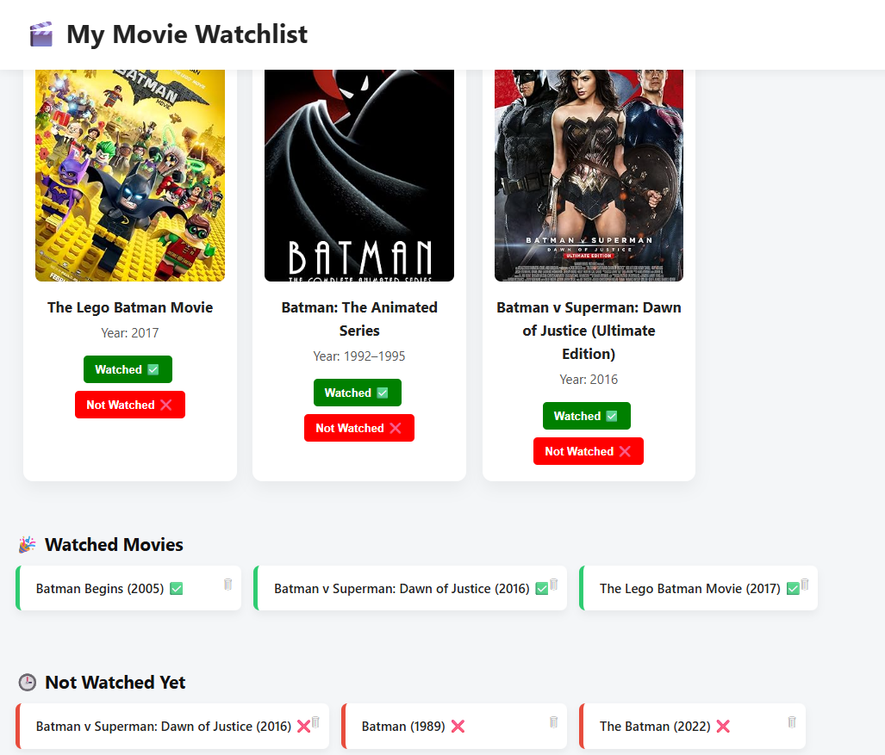

# 🎬 Movie Watchlist App

A sleek and interactive Movie Watchlist built with **HTML, CSS, and JavaScript**, powered by the **OMDb API**. You can search any movie, mark it as "Watched ✅" or "Not Watched ❌", and your list is saved in your browser with `localStorage`.

---

## 🔥 Features

- 🔎 Search movies using OMDb API
- 📌 Mark movies as **Watched** or **Not Watched**
- 💾 Saves your list in **localStorage**
- 🗑 Remove any movie from either list
- 🎨 Clean UI with smooth layout and modern buttons

---

## 📸 Screenshots

### 🔍 Search and Mark Movies


---

### ✅ Watched / ❌ Not Watched Lists



---


## 🚀 How It Works

1. Enter a movie name in the search bar
2. Results are fetched from the OMDb API
3. You can:
   - ✅ Mark it as "Watched" — it appears in the watched list
   - ❌ Mark it as "Not Watched" — it appears in the not watched list
4. Movies are saved in your browser using `localStorage`, so they persist even after refreshing

---

## ⚙️ Tech Stack

- HTML5
- CSS3
- JavaScript (DOM + localStorage)
- [OMDb API](https://www.omdbapi.com/)

---

## 📁 Project Structure
movie-watchlist-app/
├── index.html
├── script.js
├── config.js # Contains your API key 
├── styles.css
└── README.md


---

## 🔐 API Key Handling

Your `API key` is stored in a separate `config.js` file 

```js
// config.js
const apiKey = "your-api-key-here";

